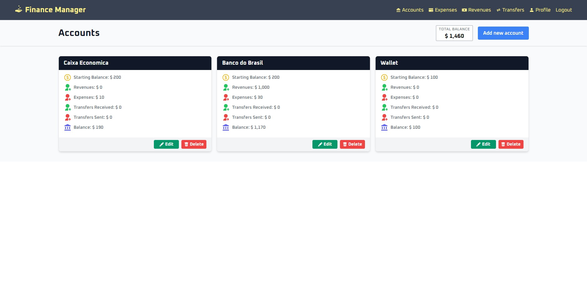

# Frontend README

## Description

The frontend of this project is built with Next.js and TypeScript and uses Tailwind for styling. It requires a backend endpoint to function properly (not necessarily the one provided in the repository). Before attempting to run it, make sure to edit the `.env` file in the project directory.

## Screenshot

[*(Check more screenshots)*](./screenshots/)

## Installation

To install and run the frontend, follow these steps:

1. Install Node.js and npm on your system.
2. Clone the project repository.
3. Navigate to the frontend directory in the project repository.
4. Edit the `.env` file in the directory to define the required environment variables.
5. Install dependencies using the command `npm install`.
6. Start the frontend using the command `npm run dev`.

Alternatively, you can use the Dockerfile in the directory to run the frontend in a Docker container. To do so, follow these steps:

1. Install Docker on your system.
2. Clone the project repository.
3. Navigate to the frontend directory in the project repository.
4. Edit the `.env` file in the directory to define the required environment variables.
5. Build the Docker image using the command `docker build -t <image-name> .` in the directory.
6. Start the Docker container using the command `docker run -p <host-port>:<container-port> -d <image-name>`.

## Usage

The frontend provides a user interface for managing user authentication, account management, expenses and revenues, and transfers. It communicates with the backend to perform these actions.

## Scripts

The following scripts are available to run the frontend:

- `npm run dev`: Start the development server.
- `npm run build`: Build the production version of the frontend.
- `npm run start`: Start the production version of the frontend.
- `npm run lint`: Lint the codebase.

These commands assume that Node.js and npm are installed on your system. If you're running the frontend in a Docker container, the scripts will automatically be executed.

## Dependencies

To run the frontend, you will need:

- Node.js and npm OR Docker installed on your system.
- A backend server to persist the data.

Please ensure that you have these dependencies installed before attempting to run the website.
